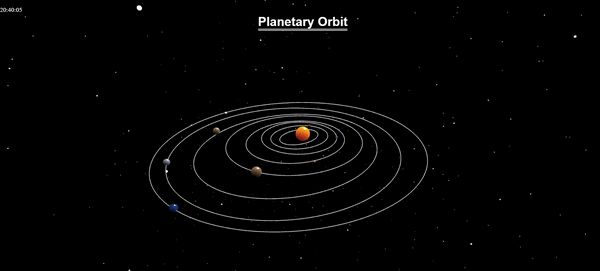
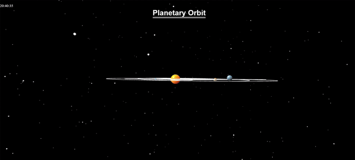
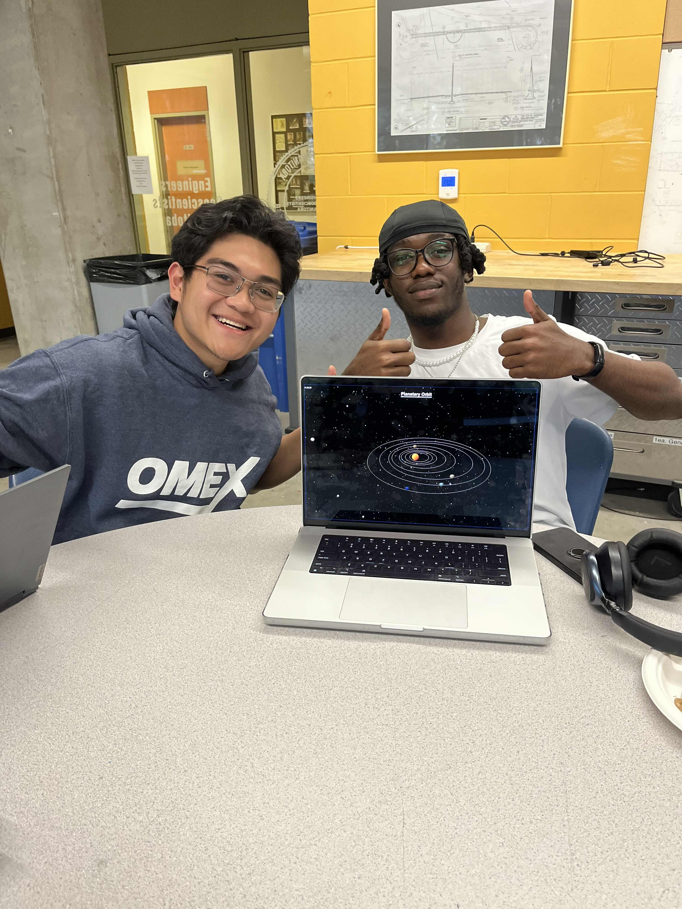

# Description
A 3D space orrery created in babylon for the Nasa Space Apps hackathon.






# How to run
1. ```npm i```
2. ```npm start``` 
3. open on http://localhost:8080/


# Details
If you wanted to see the finished project:
https://www.spaceappschallenge.org/nasa-space-apps-2024/find-a-team/tyjames/?tab=project

Project Demo:
https://docs.google.com/presentation/d/1EK-GzugJufKxXELESaPf3drUoVGPQJNyuJduuuuiruE/edit#slide=id.p
